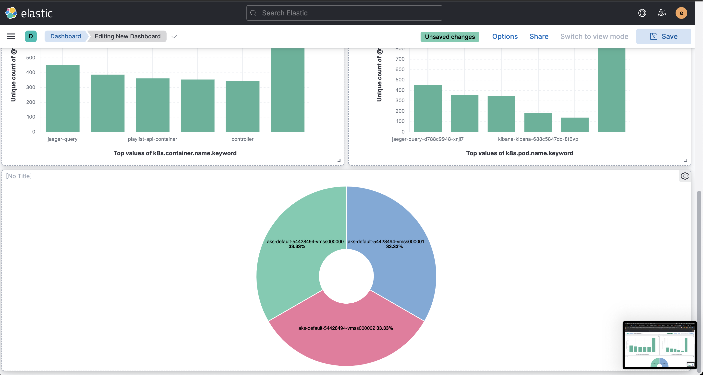

# Kubees Project

## Application Architecture


Our application architecture is really simple, **since we focused more on the infrastructure level.**

We have 3 major components:
- *Videos Web:* This is our frontend application which is responsible of displaying the various playlists and applications
- *Playlist API:* This is the first microservice which is responsible of returning all the playlists from the database
- *Videos API:* This is the videos microservice which is responsible of fetching the videos data of each playlist.

**Note: This application is inspired from [this repo.](https://github.com/marcel-dempers/docker-development-youtube-series/tree/master/kubernetes/servicemesh/applications) However, it's obvious that we changed a lot in it, in order to integrate logs, traces and monitoring. We did also some refactor and re-design of the code.**

## Observability

### Metrics
To export our metrics, we used the famous Prometheus, Grafana combo. Some other services were integrated, such as Node Exporter, in order to gather hosts metrics like CPU, RAM, and Disk usage.

We added our applications metrics for our microservices like the garbage collector usage, the heap size, etc... and there also other HTTP metrics, like the number of 20x requests, 40x requests and 50x requests.


<br>

Furthermore, we added custom business metrics, such as Top 3 playlists that have videos, number of videos per playlist, etc...

<br>


<br>

In addition to that, we added metrics of our observability services, such as Fluentbit.


<br>


### Logs
To export our logs, we used Golang Zap logger as it's the most optimized logger in terms of objects allocated per log, and some other features. The exported logs are structured in a way that we add `client_ip`, and `request_id` to each incoming request. This would be really helpful in case we want to troubleshoot if there's any issue.

Logs aggregation is done using Fluentbit. In fact, we used Fluentbit as log aggregator that will collect data from nodes and pods, store them in an Elasticsearch database, and query/consume them using Kibana (EFK stack).


<br>

This is our Fluentbit data pipeline:


<br>
As you can see in the image below, data is collected from Nodes and Pods. Data collected from pods will be modified by applying some filters and data enriching mechanisms, such as JSON parsing, field renaming, removing useless fields, etc...
The final output of these logs is in Elasticsearch database, but in differences indices.


<br>

After consuming data from Kibana, we created some helpful dashboards to give us insights about our logs. e.g: Most client IP that made requests to our pods.


<br>

<br>

<br>

<br>

### Traces
To troubleshoot network bottlenecks, we used Jaeger with the Opentelemtry collector, in order to collect traces and export them.
We have enriched our traces with some custom tags, such as `client_ip` and `UUID`, in order to help us to troubleshoot bugs and errors.


<br>

<br>

## GitOps
To leverage faster deployments and rollbacks (in case of erroneous releases), we decided to use ArgoCD as our GitOps engine, that is responsible of managing our previously stated monitoring applications.
These application are grouped into ArgoCD monitoring `Project`.


<br>

We configure ArgoCD in a way to send us notification in our Slack channel whenever a new different revision is deployed on the cluster.

<br>

## Helm charts
Every service installed on our cluster is done using Helm chart + Terraform combo.
We created our own charts, based on community charts in order to ensure some stability, and to have the freedome to add some other templates, other than those provided with the community charts.
Our charts are published on the Gitlab registry (Since GitHub pages is a paid service for organizations).

Since we have two microservices which are pretty similar to each other, we decided to create an [umbrella chart](https://github.com/kubees/microservices-umbrella-chart) (Which is a generic chart), and the microservices charts will be based on this generic chart.
We choose this design in order to remove redundancy between charts, and to make our charts pretty clean.

## Terraform
We used IaC model, in order to ensure our infrastructure idempotency.
We used Terraform microstacks to deploy different components of our infrastructure independently from each other.
We used 4 microstacks:
- Networking Stack
- AKS Stack
- Application Stack
- Observability Stack
You can refer to [this repo](https://github.com/kubees/prod-infrastructure) to get more insights of our Terraform code.

## Deployment Strategy
We have 2 principal parts in our whole application. The frontend and backend microservices.

Each one of these two parts is exposed via an Nginx ingress.

We choose **A/B staretgy** as a deployment strategy for our frontend application, and **Canary strategy** for our microservices.

To implement these two strategies, we used Flagger (Created by flux) which is a Progressive Delivery Operator for Kubernetes.

We have our deployment strategies implemented in a **fully automated way.** In fact, the rollout phase and rollback one (in case of failed release) and done automatically without any manual intervention.

To test it out for the frontend application, you can simply execute this command:
```bash
kubectl set image deployment -n frontend videos-web videos-web-container=ahmedgrati/videos-webapp:418ff18245e808425b23fe7614e3d88d4c9d0106
```
Then perform `curl` command and pass custom `headers`, like that:
```bash
curl -H 'X-Canary: insider' http://kubees.videos.app.com
```
You should have the following response:
```html
<!DOCTYPE html>
<html lang="en">

<head>
  <meta charset="utf-8" name="viewport" content="width=device-width, initial-scale=1" />
  <link rel="stylesheet" href="bootstrap.min.css">
  <title>Video Catalog V2</title>
</head>
```
If you remove the header, and re-execute the `curl` command, you should see the following response (It's version 1 HTML):
```html
<!DOCTYPE html>
<html lang="en">

<head>
  <meta charset="utf-8" name="viewport" content="width=device-width, initial-scale=1" />
  <link rel="stylesheet" href="bootstrap.min.css">
  <title>Video Catalog</title>
</head>
```

If we try update the deployment with an erroneous image, you should see an automated rollback happening. You can try it by executing this command:
```bash
kubectl set image deployment -n frontend videos-web videos-web-container=ahmedgrati/videos-webapp:v2
```

This is sneak peak of how Flagger do the job under-the-hood.


<br>

To get more insights about our Flagger manifests, check-out [this repository.](https://github.com/kubees/flagger-helm-chart)

## Application Infrastructure E2E Tests
In our [playlist microservice](https://github.com/kubees/playlist-microservice), we integrated application infrastructure E2E Tests. These tests are executed whenever we have the label `preview` in our pull request.
The workflow is like the following:


<br>

Our e2e tests are implemented using [Kubernetes E2E framework](https://github.com/kubernetes-sigs/e2e-framework).

The deployed infrastructure for e2e tests is a minimal infrastructure that has a KinD cluster, and only our application with Redis Helm charts.

This is an [example](https://github.com/kubees/playlist-microservice/actions/runs/3582935252/jobs/6027747774) of an e2e test execution.
For more details, check our [e2e test repository](https://github.com/kubees/e2e-test), and [test infrastructure repository.](https://github.com/kubees/test-infra)


## Security
This is the final part of our project. We care too much about having a secure applications and infrastructure, that's why we integrated in our CI pipelines.

For some of the Helm charts, we integrated `Checkov` to statically analyse our Helm charts. You can see an [example here.](https://github.com/kubees/microservices-umbrella-chart/actions/runs/3582139870/jobs/6026011136)

In our Terraform code, we integrated `tfsec` and `tfsec_commenter`. You can see an [example here.](https://github.com/kubees/prod-infrastructure/actions/runs/3925434380/jobs/6710351989)
